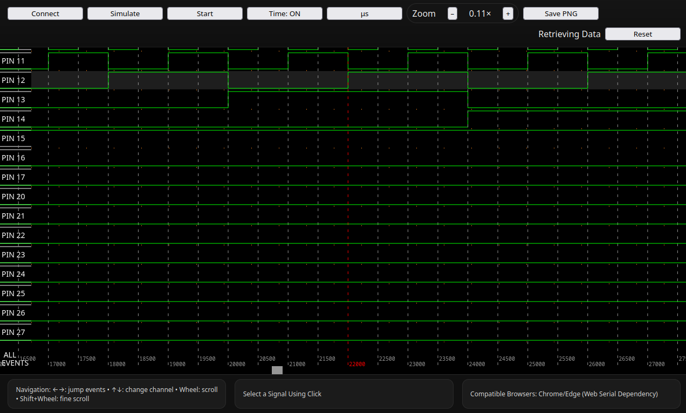

# Logic Analyzer – Web GUI

A modern, browser-based logic analyzer interface built with **TypeScript**, **HTML5 Canvas**, and **Web Serial API**.
This project provides a modular, and maintainable frontend for visualizing and interacting with digital signal captures directly in your browser, no desktop software required.

---

## Overview

The **Logic Analyzer Web GUI** connects to supported hardware devices over the **Web Serial API** or operates in **simulation mode** for development without hardware.
It visualizes captured signals, processes data in real-time, and provides a responsive interface for control and inspection.

A companion backend handles hardware communication and data streaming.
🔗 **Backend Repository:** [logic-analyzer-backend](https://github.com/sancho11/logic-analyzer)


<div style="display: flex; justify-content: center; overflow-x: auto; width: 80%;">
  <table style="table-layout: auto; border-collapse: collapse;">
    <thead>
      <tr>
        <th style="text-align: left; padding: 8px;">Web GUI</th>
      </tr>
    </thead>
    <tbody>
      <tr>
        <td style="padding: 8px;">
          
        </td>
      </tr>
    </tbody>
  </table>
</div>

---

## Features

* **Modular MVC architecture** for clarity and maintainability.
* **Web Serial** integration with robust parsing and resource management.
* **Simulation mode** for testing without hardware.
* **HiDPI Canvas rendering** with redraw-on-demand for performance.
* **Extensible design** – easily add new boards or configurations in `constants.ts`.
* **TypeScript-first** codebase for reliability and developer ergonomics.

---

## File Structure

```
logic-analyzer-webserial-ts/
├─ index.html             # Entry point for the web app
├─ styles.css             # Global styles
├─ package.json           # Project dependencies and scripts
├─ package-lock.json
├─ tsconfig.json          # TypeScript configuration
├─ vite.config.ts         # Vite build configuration
└─ src/
   ├─ main.ts             # UI initialization and event wiring
   ├─ controller.ts       # Coordinates transport, model, and view
   ├─ model.ts            # Capture buffer and data processing
   ├─ view.ts             # Canvas rendering and user interaction
   ├─ serial.ts           # Web Serial interface and simulator
   ├─ constants.ts        # UI constants and board mappings
   ├─ utils.ts            # General-purpose helper functions
   ├─ types.ts            # Shared TypeScript types
   └─ assets/             # (Optional) Static assets or icons
```

---

## Getting Started

### 1. Install Dependencies

```bash
npm install
```

### 2. Development Mode

```bash
npm run dev
```

This will start a local development server.
Access it via **[https://localhost:5173](https://localhost:5173)** (or the port shown in your terminal).
Use **Chrome** or **Edge** — both support the **Web Serial API**.

### 3. Simulation (No Hardware Required)

Click **“Simulate”** and then **“Start”** to generate and visualize example signals.

### 4. Build for Production

```bash
npm run build && npm run preview
```

---

## Architecture

The app follows a **Model–View–Controller (MVC)** pattern:

* **Model:** Manages captured data, buffering, and processing.
* **View:** Handles rendering and user input using Canvas.
* **Controller:** Connects serial input/output, manages state, and orchestrates updates.

This structure ensures a clean separation of concerns and makes the codebase easy to extend and maintain.

---

## Contributing

Contributions are welcome! To contribute:

1. **Fork** the repository.
2. **Create a branch** for your feature or fix:

   ```bash
   git checkout -b feature/my-improvement
   ```
3. **Commit your changes** with a clear message:

   ```bash
   git commit -m "Add waveform zoom functionality"
   ```
4. **Push** your branch and open a **Pull Request**.

Before submitting:

* Run `npm run lint` and ensure your code passes formatting and type checks.
* Test your changes in both **serial** and **simulation** modes.

---

## License

This project is licensed under the [MIT License](LICENSE).